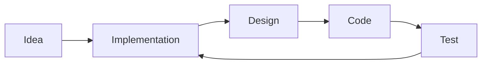

# `Zero Mark Down` Editor Changelog

ZMD is a Markdown Editor made with React + Tauri.<br>
It's a simple Desktop Application giving you support to use Markdown to create Github Documentations.

---

## Tech Stack

- Tauri
- React + Vite
- Monaco Editor for Editing
- Reach Markdown for Rendering

---

## How to Install

- Clone this repository

```bash
git clone https://github.com/chattertree/zeromarkdown.git
cd zeromarkdown
```

- Install dependencies and run the production build

```bash
npm run prod
```

And there you have it! You have your own ZMD editor.

---

## With Mermaid Support ❤️



For more info on this checkout [Mermaid docs](https://mermaid.js.org/intro/)

---

## Feature Requests

- [ ] Add a Sytem Tray Notification System
- [ ] Add a Splashscreen
- [ ] Add word count
- [ ] Add key to toggle Themes
- [ ] Add option to choose Fonts
- [ ] Add support to browse recently opened Notes

---

## Completed Stuff

- [x] Add Keyboard Shorcuts
- [x] MDX support
- [x] Create, Open and Save Files
- [x] Syntax Highlighting
- [x] Sanitize support
- [x] Mermaid Support
- [x] Add a Custom Logo
- [x] Add Code Snippets
- [x] Add Image Support
- [x] File Vault System
- [x] Auto-saving Feature
---
