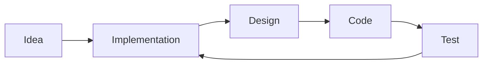

# `Zero Mark Down` Editor Changelog

Tracking all changes from here.
  

## What is it?

ZMD is a Markdown Editor made with React + Tauri. 
It's a simple Desktop Application giving you support to use Markdown to create Github Documentations.

---

## Tech Stack

- Tauri
- React + Vite
- Rust
- Monaco Editor for Editing
- Reach Markdown for Rendering

---

## Feature Requests

- [ ] Add a Sytem Tray Notification System
- [ ] Add a Splashscreen
- [ ] Add Keyboard Shortcuts
- [ ] Add a Custom Logo
- [ ] Add word count
- [ ] Add key to toggle Themes

---

## Completed Stuff

- [x] MDX support
- [x] Create, Open and Save Files
- [x] Syntax Highlighting
- [x] Sanitize support
- [x] Mermaid Support
- [x] Dark Mode
- [x] Custom Fonts

---

## With Mermaid Support ❤️

---
