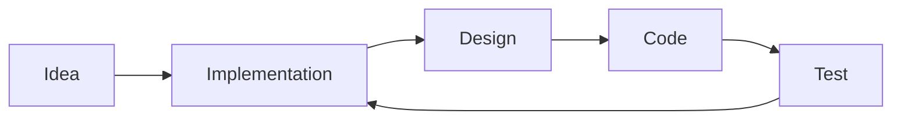

# `Zero Mark Down` Editor Changelog

ZMD is a Markdown Editor made with React + Tauri.<br>
It's a simple Desktop Application giving you support to use Markdown to create Github Documentations.

---

## Tech Stack

- Tauri
- React + Vite
- Monaco Editor for Editing
- Reach Markdown for Rendering

---

## How to Install

* Clone this repository
```bash
git clone https://github.com/chattertree/zeromarkdown.git
cd zeromarkdown
```
* Install dependencies and run the production build
```bash
npm run prod
```
* Run the following command to install an alias

NOTE: If you're not using zsh then replace `zshrc` with `bashrc`
```bash
echo "alias zmd='open -a /Applications/zeromarkdown.app --args'" >> ~/.zshrc
```
* Restart the config using the following command
```bash
source ~/.zshrc
//OR
source ~/.bashrc
```
* To create a new note inside your terminal add the command `zmd` followed by the name of the file (without any extensions)
```bash
zmd Readme
```

And there you have it! You have your own ZMD editor.

---
## With Mermaid Support ❤️


For more info on this checkout [Mermaid docs](https://mermaid.js.org/intro/)

---
## Feature Requests

- [ ] Add a Sytem Tray Notification System
- [ ] Add a Splashscreen
- [ ] Add Keyboard Shortcuts
- [ ] Add a Custom Logo
- [ ] Add word count
- [ ] Add key to toggle Themes

---

## Completed Stuff

- [x] MDX support
- [x] Create, Open and Save Files
- [x] Syntax Highlighting
- [x] Sanitize support
- [x] Mermaid Support
- [x] Dark Mode
- [x] Custom Fonts

---